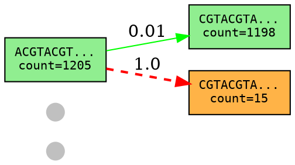
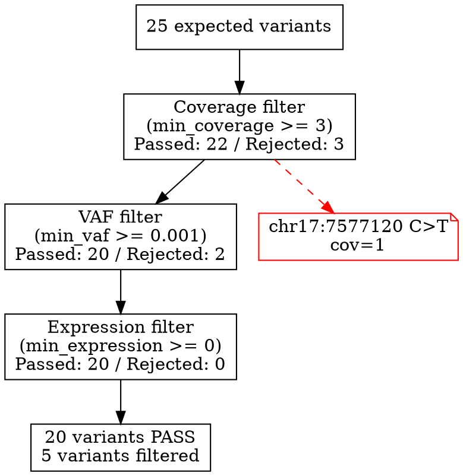

# Graph Visualization — K-mer Graph Export

## What It Does

Exports k-mer graphs in DOT format (Graphviz) and optionally renders them to SVG. Supports both the variant detection k-mer graph and a filtering analysis flow diagram. Allows researchers to visually inspect graph structure, path topology, and variant evidence.

## Why It Matters

Visual graph inspection is essential for:
- Understanding why a variant was or wasn't found (is the graph connected? are alt paths visible?)
- Debugging complex variants where multiple paths diverge/rejoin
- Verifying that the graph construction is correct (edge weights, reference path)
- Presentations and publications
- Comparing graph topology between samples

## CLI Interface

```bash
# Export graphs during detection
kmerdet detect --db sample.jf --targets targets/ --graph-output graphs/

# Export for specific targets only
kmerdet detect --db sample.jf --targets targets/ --graph-output graphs/ --graph-targets "TP53_R248W"

# Control DOT rendering
kmerdet detect --db sample.jf --targets targets/ --graph-output graphs/ --graph-format dot   # DOT only
kmerdet detect --db sample.jf --targets targets/ --graph-output graphs/ --graph-format svg   # DOT + SVG render

# Filtering flow diagram
kmerdet filter --results detect.tsv --expected expected.tsv --filter-graph filter_flow.dot
```

## Output Structure

### Detection Graphs
```
graphs/
  TP53_R248W.dot          # DOT file for this target's k-mer graph
  TP53_R248W.svg          # SVG rendering (if --graph-format svg)
  KRAS_G12D.dot
  KRAS_G12D.svg
```

### DOT Format Details



### Node Attributes
- **Reference nodes**: green fill, shows k-mer (truncated to first/last 5 bases) + count
- **Alt nodes**: orange fill, shows k-mer + count
- **Virtual nodes**: small gray points (BigBang, BigCrunch)
- **Node size**: proportional to log(count)

### Edge Attributes
- **Reference edges**: solid green, weight label
- **Alt edges**: dashed red, weight label
- **Path edges**: highlighted in blue/purple for detected variant paths

### Filtering Flow Diagram



## Data Structures

```rust
pub struct GraphExportConfig {
    pub output_dir: PathBuf,
    pub format: GraphFormat,
    pub target_filter: Option<Vec<String>>,
    pub show_counts: bool,
    pub truncate_kmers: Option<usize>,  // Show first N + last N bases
    pub highlight_paths: bool,
}

pub enum GraphFormat {
    Dot,
    Svg,  // Requires `dot` command available
}
```

## Implementation

### DOT Export
Pure Rust string formatting — no external dependencies. Generates valid DOT files.

### SVG Rendering
When `--graph-format svg`:
1. Write DOT file
2. Shell out to `dot -Tsvg` if available
3. If `dot` not available, warn and keep DOT file only

### Graph Simplification for Large Graphs
For targets with >100 nodes:
- Collapse linear chains (nodes with single in/out edge) into single labeled edges
- Show only branching points and path endpoints
- Option: `--graph-full` to force full graph even for large targets

## Acceptance Criteria

- [ ] `--graph-output <dir>` flag on detect and run subcommands
- [ ] DOT file generation for each target's k-mer graph
- [ ] Reference nodes colored green, alt nodes colored orange
- [ ] Virtual nodes (BigBang/BigCrunch) rendered as small points
- [ ] Edge weights displayed as labels
- [ ] Reference edges solid, alt edges dashed
- [ ] K-mer sequences shown (truncated for readability by default)
- [ ] K-mer counts shown on nodes
- [ ] `--graph-targets` filter for specific targets
- [ ] `--graph-format dot|svg` format selection
- [ ] SVG rendering via `dot` command when available
- [ ] `--filter-graph` on filter command for filtering flow diagram
- [ ] Graph simplification for targets with >100 nodes
- [ ] Path highlighting for detected variant paths
